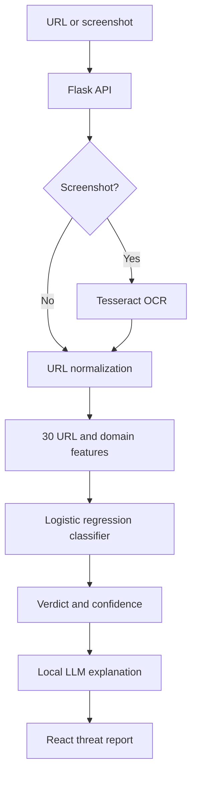

# SafeClick Hackathon Prototype

An AI-assisted phishing detection prototype that evaluates a pasted URL or a screenshot, returns a **safe**, **suspicious**, or **malicious** verdict, and explains the result in plain language.

> **Repository status:** Historical prototype. This repository contains the system created for the 2025 Hofstra x Pensar Hackathon, along with later maintenance and interface updates. It is not the current SafeClick production codebase.

## Recognition

- **1st Place**, Hofstra x Pensar Hackathon
- **Most Secure**, Hofstra x Pensar Hackathon
- Prototype foundation for [SafeClick AI](https://getsafeclick.ai/)
- [Read Hofstra's hackathon coverage](https://news.hofstra.edu/2025/04/18/pensar-hofstra-hackathon-challenges-students-to-code-collaborate-and-create/)
- [View the original pitch deck](./SafeClick%202025.pdf)

## What the prototype does

SafeClick was designed to help people make a safer decision before opening an unfamiliar link.

Users can:

- Paste a URL for analysis
- Upload a screenshot containing a visible URL
- Receive a phishing-risk verdict and confidence score
- Review a short, plain-language threat explanation
- See recommended next steps based on the result

The repository also contains a separate experimental demo exploring simulated BB84 quantum key generation and AES-encrypted URL transport. That experiment is educational and is not part of the production detection pipeline.

## Detection pipeline



### Signals evaluated

The feature-extraction layer represents each URL using 30 indicators, including:

- IP-address and URL-length patterns
- URL shorteners, redirects, subdomains, and suspicious symbols
- HTTPS and certificate-related signals
- Domain registration length, domain age, WHOIS, and DNS availability
- External resources, anchors, forms, iframes, and page behavior
- Traffic, indexing, backlink, and statistical-risk indicators

The resulting feature vector is evaluated by a scikit-learn logistic-regression model. Confidence thresholds translate the model output into safe, suspicious, or malicious classifications.

## My contributions

This was a team-built hackathon project. My work focused on the product direction and ML detection system:

- Helped shape the initial SafeClick concept and user flow
- Designed the end-to-end phishing-detection pipeline
- Implemented the 30-feature URL extraction layer
- Built and trained the logistic-regression classifier
- Connected the model output to verdict and confidence scoring
- Helped develop and deliver the competition pitch

The screenshot OCR integration was completed by a teammate after I encountered implementation issues during the hackathon.

## Technology

| Layer | Technologies |
|---|---|
| Frontend | React, React Router, Webpack, Tailwind CSS |
| API | Python, Flask, Flask-CORS |
| Machine learning | scikit-learn, pandas, NumPy, joblib |
| URL analysis | WHOIS, tldextract, Beautiful Soup, Requests |
| Screenshot analysis | Tesseract OCR, Pillow |
| Explanation layer | Ollama with a local Llama model |
| Security experiment | Qiskit simulator, AES-CBC |
| Data experiment | Firebase / Firestore |

## Project structure

```text
.
├── Backend/
│   ├── ml/                 # Training script, dataset, and serialized model
│   ├── routes/             # URL and screenshot analysis endpoints
│   ├── services/           # Feature extraction and explanation logic
│   └── app.py              # Flask application entry point
├── QC/                     # Experimental quantum-encryption demo
├── public/                 # Frontend HTML entry point
├── src/                    # React interface and threat-report experience
└── SafeClick 2025.pdf      # Original hackathon pitch deck
```

## Run locally

### Prerequisites

- Node.js 18 or newer
- Python 3.10 or newer
- Tesseract OCR available on your system PATH
- Ollama and the `llama3` model, optional for local explanations

### 1. Start the backend

```bash
cd Backend
python -m venv .venv
```

Activate the virtual environment:

```bash
# macOS or Linux
source .venv/bin/activate

# Windows PowerShell
.venv\Scripts\Activate.ps1
```

Install the dependencies and start Flask:

```bash
pip install -r requirements.txt
python app.py
```

The API runs at `http://127.0.0.1:5000`.

### 2. Start the frontend

From the repository root:

```bash
npm install
npm start
```

### 3. Optional local explanation model

```bash
ollama pull llama3
ollama serve
```

Without Ollama, the classifier still runs and the interface uses a fallback explanation.

## API endpoints

| Endpoint | Method | Purpose |
|---|---|---|
| `/api/check_url` | POST | Extract features and classify a submitted URL |
| `/api/upload_image` | POST | Validate an image, extract a URL with OCR, and classify it |

## Prototype limitations

This code reflects a time-boxed hackathon build and should not be deployed as a production security service without additional work.

- The frontend expects a locally running backend.
- The free-scan limit is stored client-side and is not an authorization control.
- CORS is permissive for local development.
- Some URL signals depend on external requests and may be unavailable or slow.
- The quantum-key workflow is a simulation, not production post-quantum transport.
- Automated classifications are decision-support signals, not guarantees that a link is safe.

## Evolution

The hackathon prototype established SafeClick's core idea: combine technical phishing signals with an explanation ordinary users can understand. The project later evolved into [SafeClick AI](https://getsafeclick.ai/), a separately maintained product with an expanded detection system and browser-extension experience.

---

Built by the HofCodePlumbers team for the 2025 Hofstra x Pensar Hackathon.
