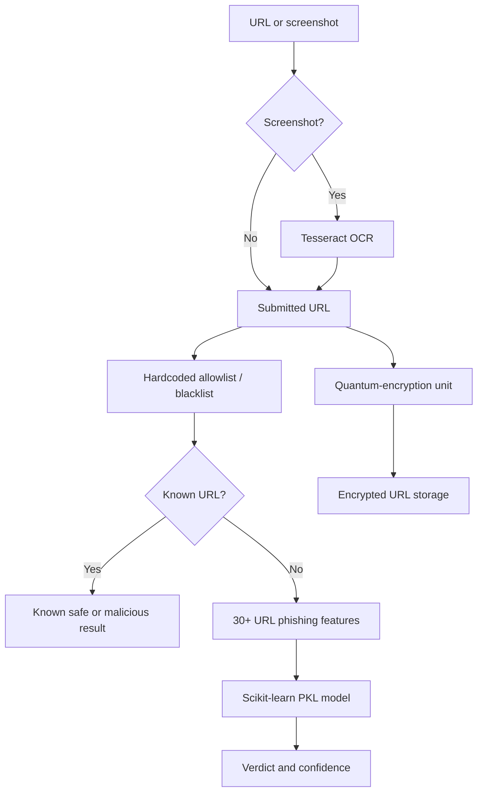

# SafeClick Hackathon Prototype

SafeClick is a phishing-detection prototype created for the 2025 Hofstra x Pensar Hackathon. It accepts a URL or a screenshot containing a URL and returns a **safe**, **suspicious**, or **malicious** assessment with a confidence score.

> **Repository status:** Historical hackathon prototype. This repository is separate from the current SafeClick production codebase, which has since evolved into a more extensive detection platform.

## Recognition

- **1st Place**, Hofstra x Pensar Hackathon
- **Most Secure**, Hofstra x Pensar Hackathon
- Prototype foundation for [SafeClick AI](https://getsafeclick.ai/)
- [Read Hofstra's hackathon coverage](https://news.hofstra.edu/2025/04/18/pensar-hofstra-hackathon-challenges-students-to-code-collaborate-and-create/)
- [View the original pitch deck](./SafeClick%202025.pdf)

## What the hackathon prototype does

Users can:

- Paste a URL for phishing analysis
- Upload a screenshot and extract a visible URL with OCR
- Receive a phishing-risk classification and confidence score
- Check known URLs against a small hardcoded allowlist and blacklist
- Encrypt submitted URLs through the project's experimental quantum-encryption unit before storage

## Hackathon architecture



### Machine-learning approach

The phishing classifier was trained using more than 30 URL-based phishing features. The training workflow produced a standard serialized scikit-learn `.pkl` model, which the Flask backend loads to classify the extracted feature vector and return a confidence score.

The hackathon system did **not** use ONNX, Google Safe Browsing, Tranco rankings, OpenPhish, URLhaus, WHOIS-age overrides, SSL-certificate scoring, multi-layer ensemble scoring, or an LLM-generated threat report. Those capabilities belong to later SafeClick work and should not be attributed to this prototype.

### Quantum-encryption unit

The project included an experimental Qiskit-based quantum-encryption component for protecting URLs submitted through the website before they were stored. This was a hackathon security experiment and not a claim of production-grade quantum infrastructure.

## My contributions

This was a team-built hackathon project. My work focused on the product direction and machine-learning detection system:

- Helped shape the initial SafeClick product concept and user flow
- Designed the end-to-end phishing-detection pipeline
- Implemented the 30+ URL phishing-feature extraction pipeline
- Built and trained the scikit-learn classifier and serialized PKL model
- Connected the model output to the verdict and confidence score
- Helped develop and deliver the competition pitch

The screenshot OCR integration was implemented by a teammate after I encountered difficulties adding it during the hackathon.

## Technology

| Layer | Technologies |
|---|---|
| Frontend | React, React Router, Webpack, Tailwind CSS |
| API | Python, Flask, Flask-CORS |
| Machine learning | scikit-learn, pandas, NumPy, joblib |
| URL detection | Hardcoded allowlist/blacklist and 30+ URL feature extraction |
| Screenshot analysis | Tesseract OCR, Pillow |
| URL-storage security experiment | Qiskit-based encryption workflow and AES |
| Data storage experiment | Firebase / Firestore |

## Project structure

```text
.
├── Backend/
│   ├── ml/                 # Training workflow, dataset, and serialized PKL model
│   ├── routes/             # URL and screenshot endpoints
│   ├── services/           # URL feature extraction
│   └── app.py              # Flask application entry point
├── QC/                     # Quantum-encryption experiment for submitted URLs
├── public/                 # Frontend HTML entry point
├── src/                    # React interface
└── SafeClick 2025.pdf      # Original hackathon pitch deck
```

## Run locally

### Prerequisites

- Node.js 18 or newer
- Python 3.10 or newer
- Tesseract OCR available on your system PATH

### Start the backend

```bash
cd Backend
python -m venv .venv
```

Activate the virtual environment:

```bash
# macOS or Linux
source .venv/bin/activate

# Windows PowerShell
.venv\Scripts\Activate.ps1
```

Install the dependencies and start Flask:

```bash
pip install -r requirements.txt
python app.py
```

The API runs at `http://127.0.0.1:5000`.

### Start the frontend

From the repository root:

```bash
npm install
npm start
```

## API endpoints

| Endpoint | Method | Purpose |
|---|---|---|
| `/api/check_url` | POST | Check the hardcoded lists or classify a URL with the PKL model |
| `/api/upload_image` | POST | Extract a URL from an image with OCR and submit it for classification |

## Prototype limitations

This code reflects a time-boxed hackathon build and should not be deployed as a production security service without additional work.

- The allowlist and blacklist are small and hardcoded.
- The model is limited by its original training data and URL-based feature set.
- OCR accuracy depends on screenshot quality and URL visibility.
- The frontend expects a locally running backend.
- CORS is permissive for local development.
- The quantum-encryption workflow is experimental rather than production quantum infrastructure.
- Automated classifications are decision-support signals, not guarantees that a link is safe.

## Evolution

The hackathon prototype established SafeClick's core concept: combine URL-based machine learning, screenshot OCR, and an approachable risk result. The project later evolved into [SafeClick AI](https://getsafeclick.ai/), a separately maintained product with a broader detection system and browser-extension experience.

---

Built by the HofCodePlumbers team for the 2025 Hofstra x Pensar Hackathon.
